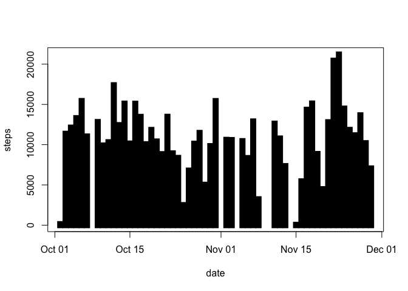
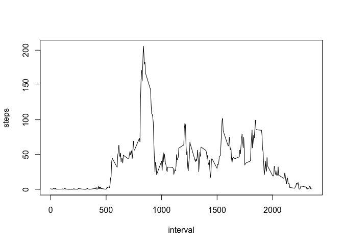
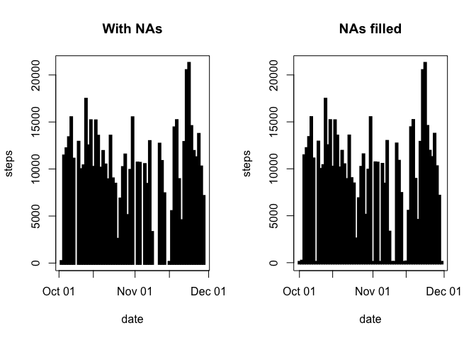
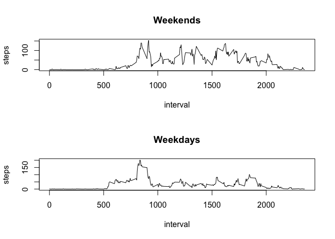

## Introduction  
  
It is now possible to collect a large amount of data about personal movement using activity monitoring devices such as a Fitbit, Nike Fuelband, or Jawbone Up. These type of devices are part of the “quantified self” movement – a group of enthusiasts who take measurements about themselves regularly to improve their health, to find patterns in their behavior, or because they are tech geeks. But these data remain under-utilized both because the raw data are hard to obtain and there is a lack of statistical methods and software for processing and interpreting the data.  
  
We aimed to make use of data from a personal activity monitoring device. This device collects data at 5 minute intervals through out the day. The data consists of two months of data from an anonymous individual collected during the months of October and November, 2012 and include the number of steps taken in 5 minute intervals each day.  
  
The data for this assignment can be downloaded from:
* Dataset: [Activity monitoring data](https://d396qusza40orc.cloudfront.net/repdata%2Fdata%2Factivity.zip)  
  
The variables included in this dataset are:  
  
steps: Number of steps taking in a 5-minute interval (missing values are coded as 𝙽𝙰) </br>
date: The date on which the measurement was taken in YYYY-MM-DD format </br>
interval: Identifier for the 5-minute interval in which measurement was taken </br>
The dataset is stored in a comma-separated-value (CSV) file and there are a total of 17,568 observations in this dataset. 
  
  
  
## Loading and preprocessing the data  
### (1) Code for reading in the dataset and/or processing the data  

```r
unzip("activity.zip",exdir = "data")
activity <- read.csv("data/activity.csv")

sapply(activity, class)
```

```
##     steps      date  interval 
## "integer"  "factor" "integer"
```

```r
activity$date <- as.Date(activity$date, format = "%Y-%m-%d")
suppressWarnings(library(zoo))
```

```
## 
## Attaching package: 'zoo'
```

```
## The following objects are masked from 'package:base':
## 
##     as.Date, as.Date.numeric
```

```r
summary(activity)
```

```
##      steps             date               interval     
##  Min.   :  0.00   Min.   :2012-10-01   Min.   :   0.0  
##  1st Qu.:  0.00   1st Qu.:2012-10-16   1st Qu.: 588.8  
##  Median :  0.00   Median :2012-10-31   Median :1177.5  
##  Mean   : 37.38   Mean   :2012-10-31   Mean   :1177.5  
##  3rd Qu.: 12.00   3rd Qu.:2012-11-15   3rd Qu.:1766.2  
##  Max.   :806.00   Max.   :2012-11-30   Max.   :2355.0  
##  NA's   :2304
```
  
  
## What is mean total number of steps taken per day?  
(For this part of the assignment, you can ignore the missing values in the dataset.)  
  
1. Calculate the total number of steps taken per day  
  

```r
steps_day <- aggregate(steps ~ date, rm.na = TRUE, data = activity, FUN = sum)
head(steps_day, 10)
```

```
##          date steps
## 1  2012-10-02   127
## 2  2012-10-03 11353
## 3  2012-10-04 12117
## 4  2012-10-05 13295
## 5  2012-10-06 15421
## 6  2012-10-07 11016
## 7  2012-10-09 12812
## 8  2012-10-10  9901
## 9  2012-10-11 10305
## 10 2012-10-12 17383
```

### (2) Histogram of the total number of steps taken each day  

2. If you do not understand the difference between a histogram and a barplot, research the difference between them. Make a histogram of the total number of steps taken each day.   


```r
plot(steps_day, type = "h", lwd = 10, lend = "square")
```

<!-- -->

### (3) Mean and median number of steps taken each day  

3. Calculate and report the mean and median of the total number of steps taken per day    


```r
Mean_Steps <- mean(steps_day$steps, na.rm = TRUE)
Median_Steps <- median(steps_day$steps, na.rm = TRUE)

c(Mean_Steps, Median_Steps)
```

```
## [1] 10767.19 10766.00
```


## What is the average daily activity pattern?   

### (4) Time series plot of the average number of steps taken  
  
1. Make a time series plot (i.e. 𝚝𝚢𝚙𝚎 = "𝚕") of the 5-minute interval (x-axis) and the average number of steps taken, averaged across all days (y-axis)    

```r
plot(aggregate(steps ~ interval, data = activity, FUN = mean), type = "l")
```

<!-- -->


2. Which 5-minute interval, on average across all the days in the dataset, contains the maximum number of steps?  
  
### (5) The 5-minute interval that, on average, contains the maximum number of steps  

```r
max(activity$steps, na.rm = TRUE)
```

```
## [1] 806
```


## Imputing missing values  
### (6) Code to describe and show a strategy for imputing missing data  

1. Calculate and report the total number of missing values in the dataset (i.e. the total number of rows with 𝙽𝙰s) 


```r
sum(is.na(activity))
```

```
## [1] 2304
```
  
2. Devise a strategy for filling in all of the missing values in the dataset. The strategy does not need to be sophisticated. For example, you could use the mean/median for that day, or the mean for that 5-minute interval, etc.
-> Fill in missing values with the median of dataset.  
  
3. Create a new dataset that is equal to the original dataset but with the missing data filled in.  

```r
activity2 <- activity
activity2$steps[is.na(activity2$steps)] <- median(na.omit(activity$steps))
activity2$date <- as.Date(activity2$date, format = "%Y-%m-%d")
```
  
4. Make a histogram of the total number of steps taken each day and calculate and report the mean and median total number of steps taken per day. Do these values differ from the estimates from the first part of the assignment? What is the impact of imputing missing data on the estimates of the total daily number of steps?  
  
### (7) Histogram of the total number of steps taken each day after missing values are imputed  
  

```r
steps_day2 <- aggregate(steps ~ date, rm.na = TRUE, data = activity2, FUN = sum)

par(mfrow = c(1, 2))
plot(steps_day, type = "h", lwd = 5,lend = "square", main = "With NAs")
plot(steps_day2, type = "h", lwd = 5, lend = "square", main = "NAs filled")
```

<!-- -->

```r
dev.off()
```

```
## null device 
##           1
```
  
  
  
## Are there differences in activity patterns between weekdays and weekends?  
  
1. Create a new factor variable in the dataset with two levels – “weekday” and “weekend” indicating whether a given date is a weekday or weekend day.  
  

```r
activity2$weekday <- factor(format(activity2$date, "%A"))

levels(activity2$weekday) <- list(weekday = c("Monday", "Tuesday", "Wednesday",
                                              "Thursday", "Friday"), 
                                  weekend =c("Saturday", "Sunday"))
```
  
2. Make a panel plot containing a time series plot (i.e. 𝚝𝚢𝚙𝚎 = "𝚕") of the 5-minute interval (x-axis) and the average number of steps taken, averaged across all weekday days or weekend days (y-axis). See the README file in the GitHub repository to see an example of what this plot should look like using simulated data.  

### (8) Panel plot comparing the average number of steps taken per 5-minute interval across weekdays and weekends  
  

```r
par(mfrow = c(2, 1))

with(activity2[activity2$weekday == "weekend",], plot(aggregate(steps ~ interval, FUN = mean), type = "l", main = "Weekends"))

with(activity2[activity2$weekday == "weekday",], plot(aggregate(steps ~ interval, FUN = mean), type = "l", main = "Weekdays"))
```

<!-- -->

```r
dev.off()
```

```
## null device 
##           1
```
  

### (9) All of the R code needed to reproduce the results (numbers, plots, etc.) in the report  

fin
